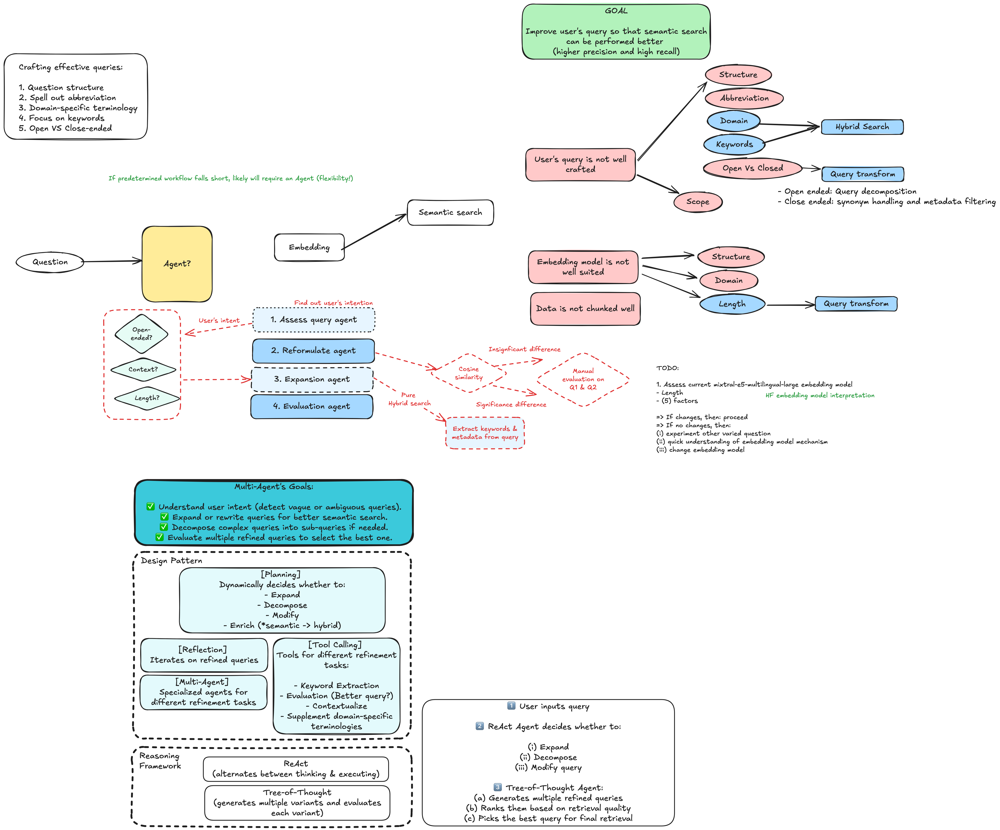

# Some observations (draft)

- CodeAgent using Phi-4, does not perform well even with simple code generation

```py
for refined_query in refined_queries:
    similarity_score = calculate_text_similarity(
        text_1=original_query,
        text_2=refined_query
    )
    similarities.append(similarity_score)
    print(f"Similarity between original and '{refined_query}': {similarity_score}")
```

# Samples

## Phi-4

- Input: Any recent news on Ukraine and US?
- Output:

```
Final answer: {'original_query': 'Any recent news on Ukraine and US?', 'refined_queries':
['What are the latest political developments between Ukraine and the United States as of [current
month]?', 'Recent diplomatic interactions between Ukraine and the US in [specific timeframe].',
'News articles on recent international affairs involving Ukraine and the United States.',
'Current events related to Ukraine-US relations published in [last month/year].'],
'similarities': [0.0, 0.0, 0.0, 0.0]}
```
